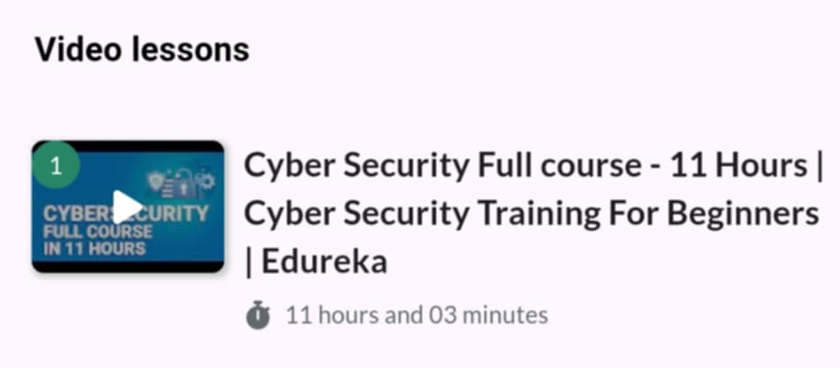
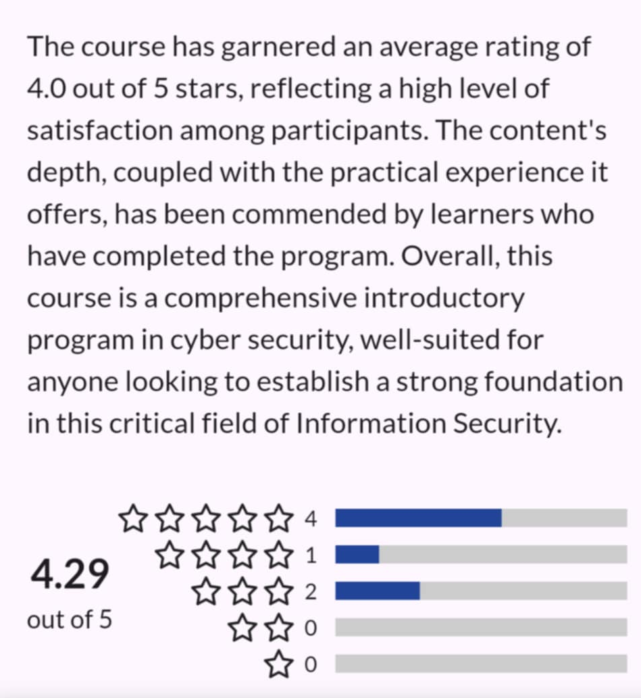

# 🛡️ Cyber Security Masterclass – InfoSecTrain  

    

This repository contains **notes, labs, playbooks, scenarios, research case studies, and certificate of completion** for the *Cyber Security Masterclass* program by InfoSecTrain.  
The course provides a solid foundation in **cybersecurity fundamentals, network defense, cryptography, incident response, and compliance**.  

---

## 📚 Notes  

- 📄 [`01-introduction-to-cybersecurity.md`](./notes/01-introduction-to-cybersecurity.md) – Introduction to cybersecurity  
- 📄 [`02-cyber-attacks-and-threats.md`](./notes/02-cyber-attacks-and-threats.md) – Cyber attacks & threats overview  
- 📄 [`03-network-security-basics.md`](./notes/03-network-security-basics.md) – Network security fundamentals  
- 📄 [`04-cryptography-basics.md`](./notes/04-cryptography-basics.md) – Cryptography basics  
- 📄 [`05-identity-and-access-management.md`](./notes/05-identity-and-access-management.md) – Identity & Access Management (IAM)  
- 📄 [`06-security-operations.md`](./notes/06-security-operations.md) – Security operations & SOC  
- 📄 [`07-incident-response.md`](./notes/07-incident-response.md) – Incident response process  
- 📄 [`08-security-compliance.md`](./notes/08-security-compliance.md) – Compliance & regulations  
- 📄 [`09-future-trends.md`](./notes/09-future-trends.md) – Future trends in cybersecurity  

---

## 🧪 Labs  

- 🔍 [`hands-on-demos.md`](./labs/hands-on-demos.md) – Hands-on demonstrations  
- 🛠️ [`practical-exercises.md`](./labs/practical-exercises.md) – Practical cybersecurity exercises  
- ⚔️ [`red-team-vs-blue-team.md`](./labs/red-team-vs-blue-team.md) – Red Team vs Blue Team exercises  

---

## 📋 Playbooks  

- ✅ [`phishing-incident.md`](./playbooks/phishing-incident.md) – Responding to phishing attacks  
- ✅ [`malware-outbreak.md`](./playbooks/malware-outbreak.md) – Malware outbreak handling  
- ✅ [`data-breach.md`](./playbooks/data-breach.md) – Data breach response  
- ✅ [`ddos-attack.md`](./playbooks/ddos-attack.md) – DDoS mitigation strategy  

---

## 🎭 Scenarios  

- ✉️ [`phishing-simulation.md`](./scenarios/phishing-simulation.md) – Phishing simulation scenario  
- 🔒 [`ransomware-attack.md`](./scenarios/ransomware-attack.md) – Ransomware incident scenario  
- ☁️ [`cloud-misconfiguration.md`](./scenarios/cloud-misconfiguration.md) – Cloud misconfiguration case  
- 🕵️ [`insider-threat.md`](./scenarios/insider-threat.md) – Insider threat activity  

---

## 🔬 Research & Extras  

- 📑 [`case-studies.md`](./extras/case-studies.md) – Cybersecurity case studies  
- 📚 [`resources.md`](./extras/resources.md) – Recommended resources & tools  
- 📆 [`timeline.md`](./extras/timeline.md) – Cybersecurity history & evolution  

---

## 📖 Docs  

- 📘 [`glossary.md`](./docs/glossary.md) – Cybersecurity glossary  
- 📘 [`index.md`](./docs/index.md) – Index & course overview  
- 📘 [`references.md`](./docs/references.md) – References & bibliography  
- 📘 [`roadmap.md`](./docs/roadmap.md) – Learning roadmap  
- 📘 [`syllabus.md`](./docs/syllabus.md) – Course syllabus  

---

## 📸 Screenshots  

| Step                  | Screenshot |
|-----------------------|------------|
| 🏫 Course Overview    |  |
| 📘 Course Modules     |  |
| ⭐ Course Review      |  |

---

## 📜 Certificate  

🎓 [`Cyber Security Masterclass – InfoSecTrain`](./cert/Cyber%20Security%20Masterclass%20by%20INFOSEC%20TRAIN.jpg)  

---

## 📝 Personal Review  

This program helped me reinforce my **knowledge of cybersecurity essentials**.  
I especially valued the **labs on Red Team vs Blue Team** which simulated real-world defense scenarios.  
The **incident response playbooks and case studies** also gave me practical frameworks to apply in security operations.  

Overall, it’s a strong learning path for those who want a **comprehensive overview of cybersecurity fundamentals with practical exposure**.  

---

## ✍️ Author  

**Thành Danh** – Red Team Learner & Security Researcher  

- GitHub: [@ngvuthdanhh](https://github.com/ngvuthdanhh)  
- Email: ngvu.thdanh@gmail.com  

---

## 📄 License  

This project is licensed under the terms of the **MIT License**.  
See [`LICENSE`](./LICENSE) for details.  

© 2025 ngvuthdanhh. All rights reserved.  
